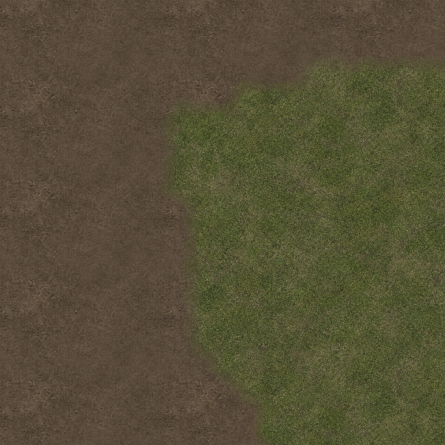

# Sol organique : commandes retenues et regroupement par matière

Validation native du 12 septembre 2026. Vue réelle du dôme généré avec seed 12345, deck 3, centre `(124,146)`, 32 pixels par cellule, fenêtre 1920×1080, supersampling effectif 1. La simulation est en pause ; le rendu normal complet reste actif. Chaque mesure attend le deck prêt puis 120 images de chauffe et mesure 240 images, sans capture, lecture GPU ou écriture de fichier pendant la boucle chronométrée.

| État | Draw moyen | Médiane | P95 | FPS mesurés | Appels GPU / image | Primitives / image |
|---|---:|---:|---:|---:|---:|---:|
| Avant corrections de performance | 163,30 ms | 164,45 ms | 204,01 ms | 6,02 | 23 145 | 631 821 |
| Cache organique + regroupement par cellule, eau retenue | 22,21 ms | 22,34 ms | 35,17 ms | 39,91 | 923 | 631 629 |
| Regroupement organique global final | 21,88 ms | 21,74 ms | 34,89 ms | 40,00 | 363 | 631 629 |

Le passage final réduit encore les appels GPU de 60,7 %, sans gain FPS significatif dans cette mesure. Le gain global de la première à la dernière ligne inclut les corrections d'eau et de rendu concurrentes ; ce n'est pas une mesure isolée du temps CPU du sol. Le temps `Draw` contient aussi les attentes du pilote, et ne représente pas un temps GPU isolé.

## Cause et correction

Le mélange de matériaux utilisait 12×12 sous-échantillons par cellule, contre 8×8 auparavant. Plusieurs familles pouvaient contribuer à chaque sous-échantillon. Avec `SpriteSortMode.Deferred`, cette succession herbe/terre/herbe/terre entraînait une alternance de textures pour chaque petit carré. Le bruit et les poids de mélange étaient également recalculés dans `Draw` à chaque image.

`SpriteFloorSkin.OrganicPlanCache` retient désormais les commandes de sprite : position, fenêtre texture, couleur, opacité et échelle. Une entrée dépend du voisinage exact 3×3 des types de terrain et de la présentation des familles. Une modification de fuite, d'eau, de curseur ou de corruption ne l'invalide pas. Un changement local de terrain, de banque de familles, de texture d'herbe de remplacement ou de scène déclenche la reconstruction adaptée.

Les listes visibles de `OrganicPass` réutilisent leur stockage. Le sol dessine d'abord les plaques et leurs joints, puis les couches organiques dans l'ordre `OrganicFamilies`. Les quads restent dans leur propre cellule ; les sous-échantillons d'une cellule ne recouvrent pas ceux d'une autre. Le remplissage organique des cellules découpées par les courbes utilise la même file. Aucun autre passage de rendu n'a été réordonné.

## Validation

- 52 tests ciblés Organic/Floor/WallVolume réussis, aucun échec. Les nouveaux tests vérifient les fenêtres de texture, couleurs et couches de chaque sous-échantillon, le raster CPU avant/après regroupement global en présence de métal/pierre et de végétation, les invalidations locales et l'absence d'allocation des commandes et listes après chauffe.
- Comparaison native du passage `SpriteFloorSkin` de production sur les vraies cellules générées, entre les DLL « par cellule » et « global final » : **0 pixel différent et 0 écart de canal RGBA sur quatre images 1920×1080**. Cadrages : frontière `(124,146)` à 32 px/cellule ; frontière `(124.173,146.219)` à 48 px/cellule avec translation fractionnaire ; herbe `(184,82)` à 32 px/cellule ; extrémité est de la courbe de séparation du dôme à 32 px/cellule. Le sol est rendu seul pour isoler cette comparaison des animations d'eau et des autres passes. Le résultat ne prétend pas établir une identité de l'image complète du jeu entre tous les correctifs. Voir `floor-raster-comparison.json` et les recadrages ci-dessous.
- Les cinq identités observées (scène statique, disposition des murs, source des fixtures, plan des partitions, portes du plan de lumière) restent stables pendant les trois mesures. Il s'agit d'une scène en pause ; ce constat ne couvre pas les invalidations pendant une animation de porte.
- Aucune lumière de spot dans ce cadrage (`GlowMeshes = 0`) : les spots ne sont pas responsables du coût constaté dans cette vue.
- Données brutes : `floor-before.json`, `floor-cell-batches.json`, `floor-final.json`. Les outils et DLL isolées sont sous `.artifacts/render-performance` dans Code. Le premier essai `before-boundary.json` a chevauché un autre processus et n'est pas utilisé dans le tableau.

Empreintes SHA256 des DLL Client isolées :

- Avant : `0FEA6C06A4D2ACE92B7CC6F7B21D7AD3CE72E89B6F138F16A4FF12531FBAE98B`.
- Par cellule : `EFA3599D8121F5C81AC3E9A312F4B50B2977D95C97B77367B4EE8213876CF5CA`.
- Global final : `8BFBFCE530B006E0C26DF1B85426751EEF53737A303E76EBBAFA88209D8CDC5A`.

## Frontière de terrain, recadrages natifs identiques

Avant le regroupement global :

Après le regroupement global :

