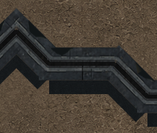
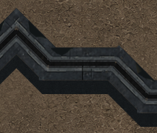
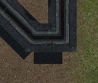
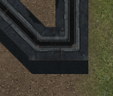

# Raccords des cloisons ruinées du dôme

Les triangles de terrain visibles sous les coudes venaient du volume latéral : chaque segment était extrudé comme un rectangle terminé à angle droit. Le dessus de la cloison suivait déjà un raccord en onglet, mais le volume sous ce dessus laissait un coin vide à la jonction diagonale/horizontale.

`WallVolumeGeometry.AddPartitionBody` reprend maintenant les deux chaînes décalées du mur et raccorde les segments aux mêmes points d’onglet. Les faces de fermeture restent aux vraies extrémités de chaque portion. Les passages entre portions, la topologie Core, les dégâts, les matériaux et l’aspect ruiné approuvé ne changent pas.

## Preuve native alignée

Le banc utilise le vrai `TheEndGame`, ses données et son composite final. Le helper choisit seulement le pont et la caméra : pont 3 interne (affiché « PONT 4/6 »), centre `(124,146)`, 1920 × 1080, 48 px/cellule, pan `(-4992,-6568)`. Aucun `DisplayFrame` fabriqué, changement des murs, déplacement artificiel des objets ou modification des ticks.

| Coude | Avant | Après |
|---|---|---|
| Gauche, autour de `(305,480)` |  |  |
| Bas, autour de `(1025,716)` |  |  |

Les recadrages sont extraits sans retouche ni changement d’échelle. Les deux triangles sont fermés par la continuité du flanc métallique. Les captures complètes permettent de vérifier les vraies interruptions : [avant](ruin-joints-before.png), [après](ruin-joints-after.png).

## Vérification des zones conservées

La comparaison des pixels est exacte, sans tolérance. Les zones utilisent des rectangles de coordonnées `(x0,y0,x1,y1)` dans le composite natif.

| Zone | Rectangle | Pixels | Pixels modifiés |
|---|---|---:|---:|
| Sol hors murs | `(300,80,950,320)` | 156 000 | 0 |
| Herbe hors murs | `(1200,350,1850,850)` | 325 000 | 0 |
| Vrai passage entre deux portions | `(655,475,760,550)` | 7 875 | 0 |
| Dessus du mur et patine | `(475,472,628,510)` | 5 814 | 0 |

L’eau est exclue de cette vérification d’invariance : cette révision inclut son passage à une animation GPU, évaluée séparément dans [water-gpu.md](water-gpu.md). Les métadonnées périodiques du helper enregistrent les ticks 12414 avant et 12408 après ; la simulation avance normalement. Cela n’affecte pas les zones statiques comparées.

## Versions et portée

| Élément | SHA-256 |
|---|---|
| Client avant | `0FEA6C06A4D2ACE92B7CC6F7B21D7AD3CE72E89B6F138F16A4FF12531FBAE98B` |
| Client après | `EFA3599D8121F5C81AC3E9A312F4B50B2977D95C97B77367B4EE8213876CF5CA` |
| PNG avant | `7F0C2FC7CAF1F878AA8776B6659167F6085095D5B91B677962CE38626E1D0E18` |
| PNG après | `FC8AEDCBC32099E6E9272C6C39E481ADFA781AD24B5C5305F59DC8131EE9A7C3` |

La DLL après contient la géométrie finale des raccords muraux et une version intermédiaire du rendu du sol, antérieure au dernier regroupement global des buffers du terrain. Cette preuve valide les raccords des murs ; elle ne remplace pas la vérification native de la dernière DLL globale.

Validation centralisée : **28 tests `WallVolumeGeometryTests` réussis**, dont neuf nouvelles régressions couvrant le coude diagonal sous quatre rotations et deux réflexions, ses faces d’extrémité, et un véritable passage entre portions séparées. Pas de TRX dédié à cette exécution ; la suite Renderer finale couvre également ces tests.

Les métadonnées et mesures sont dans [ruin-joints-comparison.json](ruin-joints-comparison.json), [probe avant](ruin-joints-before.probe.json) et [probe après](ruin-joints-after.probe.json). Le script reproductible de comparaison et les binaires isolés sont conservés dans `TheEnd/.artifacts/partition-volume-gap/` ; invocation de la capture après : `run.ps1 -Name after-capture -Binary after-native`. Un nom de sortie déjà existant est refusé.
