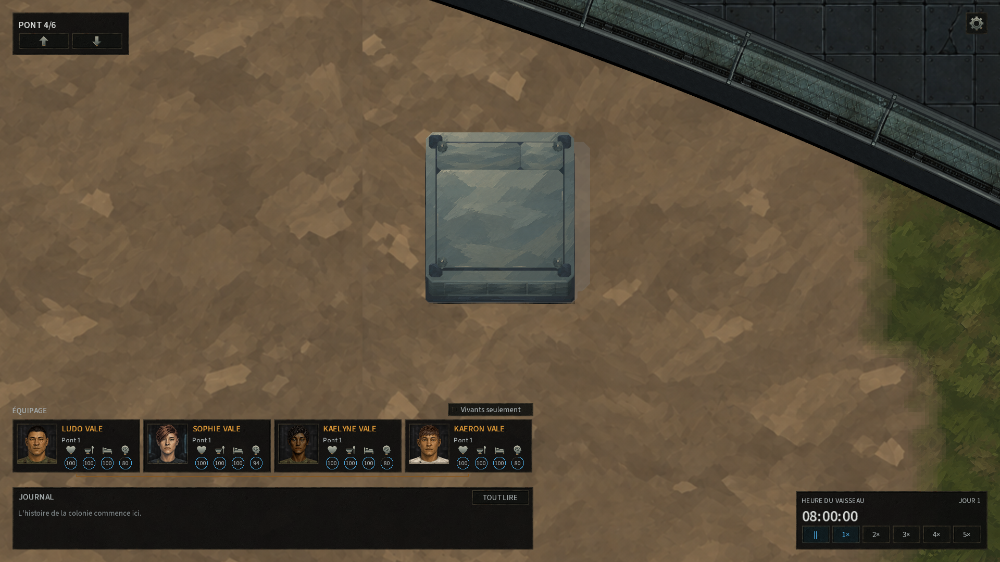

# Coffrage fermé de la colonne d’ascenseur dans le dôme

Ludovic signale le carré isolé qui garde des hachures vectorielles et un trou noir
en mode sprite. Il s’agit de la traversée scellée de l’ascenseur principal : la
route passe au-dessus et au-dessous du dôme, sans y avoir de palier. L’ascenseur
propre au dôme et l’accès manuel sont deux autres objets.

Le client ordinaire remplace désormais ce carré intact par un coffrage métallique
peint en volume : capot plein, joints en retrait, quatre attaches et côtés sombres.
La matière reprend l’atlas métallique V2 approuvé. Aucun accès ni état de gameplay
n’est ajouté. Les anciennes sources d’ascenseur et d’échelle sont conservées.

## Source et intégration

- Source : `TheEnd-Art/objects/sealed-shaft/sealed-shaft.blend`, SHA256
  `787752FA4900EA5E8C7EBF93F2571A234C96DE4A0DF309E24E59A4FB7D8BB4A4`.
- Export canonique installé : `TheEnd.Client/Assets/models/sealed-shaft` ; onze
  fichiers, une texture, quatre groupes opaques, 3 096 triangles. Part/style
  `sealed-shaft` / `sealed`, une racine, pose idle d’une image, aucune émission.
- Manifeste : SHA256
  `42558820CA7CFCD99C3964D6DDFE5938CBF2D216DB878A7D742FBBEA56519067`.
- Emprise source XY de −1,49 à 1,49 ; hauteur 0 à 0,702. Projection et ombres
  utilisent les mêmes renderers que les autres modèles. Banque chargée dans
  LoadContent et gardée jusqu’à Dispose ; culling selon les bornes projetées.
- `SpriteSealedShaftPresentation` retrouve la traversée depuis les routes
  persistées et les profondeurs du ShipPlan, car VerticalCrossing n’est qu’une
  donnée de génération. Elle exige les huit murs intacts sur métal, le cœur Mass
  sans structure, aucune feature/porte et les huit arêtes actuelles du WallWeb.
- Si cette structure change ou si la banque manque, le rendu existant reprend.
  La présentation réutilise sa liste et sa révision lors du pan ou des changements
  d’air, de curseur et d’alimentation. Aucune modification du monde ni du format
  des sauvegardes.
- La première capture avec modèle a révélé le liseré vectoriel encore dessiné
  autour du socle. `SpriteSealedShaftDecorCache` prépare un décor sprite qui omet
  uniquement l’anneau carré 3×3 de ce coffrage dans TrimSkin. Les hachures MassSkin
  et tous les autres contours restent les mêmes. Deux lots de détail au maximum
  sont conservés ; pan et bascule de mode ne vident pas ce cache ni StaticDeck.

## Vérifications

Les [preuves de l’export](model-validation.json) documentent source, UV, skinning
et fichiers installés. [Le contrôle des assets](asset-validation.json) compare
les exports aux copies Code et bin, ainsi que les seize assets historiquement
préservés, l’eau, la glace et l’espace peint.

La [note du helper natif](native-probe.md) décrit le sujet réel et le cadrage :
seed 12345, dôme deck3, origine (158,42), centre (159,5 ;43,5), tick 12000 en pause.
La route principale dessert les ponts 0/1/2/4/5 et ne s’arrête pas au pont3.

Compilation Debug réussie sans avertissement ni erreur. La première suite a
réussi 85 tests sur 86 : le test d’allocation a détecté 32 octets par image dans
TryLandingOn. Son remplacement local par le parcours indexé existant supprime
cette allocation ; les 28 tests de la nouvelle présentation et de sa banque ont
ensuite tous réussi, dont 1 000 préparations chaudes sans allocation. Les 58 tests
voisins (accès verticaux, ascenseur, échelle et architecture du dôme) avaient tous
réussi et leurs sources n’ont pas changé. Résultats conservés dans
[sealed-shaft.trx](sealed-shaft.trx) et [sealed-shaft-final.trx](sealed-shaft-final.trx).
Après suppression du cadre, les 50 tests de présentation/banque/cache/trim ont
réussi. Un avertissement xUnit dans un nouveau test a été corrigé, puis les neuf
tests de décor ont repassé sans avertissement. Le [bilan des suites](test-summary.json)
compte **108 tests distincts au dernier résultat réussi**. La préparation du
décor répété est également vérifiée sans allocation. Huit fichiers C# contrôlés
par CSharpier. Client final : SHA256
`67A137411218D9478BA47CE876DCFEBFEB6066D7BFA870EB00F358DC68CF72F3`.

La vue [native-after96](native-after96/game-SealedShaft.png) est un résultat
intermédiaire conservé : le capot est correct, mais l’ancien cadre vectoriel
reste visible en bordure. Son JSON Passed porte sur les contrôles structurels et
GPU, pas sur la qualité de ce raccord. Les captures finales après suppression de
ce contour ont été inspectées aux deux zooms :

- [Zoom normal 48 pixels/case](native-final48/game-SealedShaft.png) et
  [preuve native](native-final48/native-game-validation.json).
- [Gros plan natif 96 pixels/case](native-final96/game-SealedShaft.png) et
  [preuve native](native-final96/native-game-validation.json).

Les deux sessions affichent un coffrage, une révision stable et les mêmes
instances de banque, présentation, listes, cache du décor et lot GPU pendant
35 intervalles. Un seul lot de décor retenu sur les deux autorisés. Le cadre
vectoriel extérieur a disparu ; capot, socle et ombre sont visibles. Aucune
évaluation de FPS global n’est revendiquée.

La [comparaison exacte des pixels](native-pixel-comparison.json) porte sur le
cadrage 96 avant/final : 112 325 pixels changent dans la zone du coffrage et de
son ombre ; **zéro différence sur les 1 929 300 pixels contrôlés en dehors**.
Les images n’ont été ni redimensionnées ni retouchées. Aucun processus natif
laissé actif.

Aucun commit/push Code, Art ou Docs. L’appréciation artistique de cette nouvelle
retouche reste à recueillir auprès de Ludovic.
