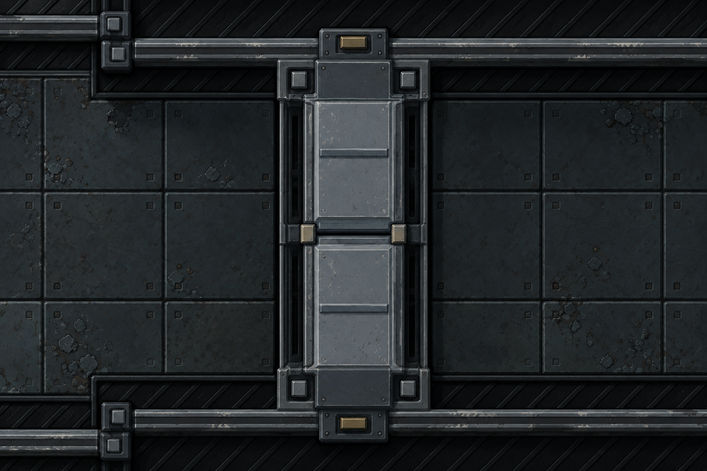

# Portes de sas — recherche visuelle

**12 septembre 2026 — sas A validé puis intégré au jeu à la demande de Ludovic : « Implémentes du coup ».**

[Intégration, captures du rendu normal et commandes](integration.md).

[Nouvel essai : raccord aux murs, animation corrigée et preuves natives](retouche-murs-ouverture.md).

[Historique du premier modèle natif rejeté](modele-3d.md).

Ludovic choisit explicitement A : « A est très bien ». La référence retenue est
[direction-v2-a-monobloc.png](direction-v2-a-monobloc.png) : deux coques sobres,
larges chanfreins, carters anguleux intégrés aux murs, peinture ardoise et petites
touches de laiton. Conserver ce dessin pour la future modélisation du sas.
Cette validation porte sur l'apparence de l'étude fermée. Ludovic demande ensuite
« Go pour le modèle 3D du coup » : la source Blender, les logements et l'animation
sont maintenant réalisés et vérifiés dans un banc natif externe. Le rendu du
modèle a ensuite été rejeté : Ludovic trouve le dessin incohérent avec les murs et
signale un tremblement pendant l'ouverture. Le concept A reste la référence ; le
modèle, ses matières et les faces qui clignotaient sont repris dans le nouvel essai.
Ludovic valide ensuite ces nouvelles captures et l'ouverture : « C'est bon ! ». La
source retenue porte le SHA `84012115713aa568cb6f888b56c98d648574da4bf0b4d86f5cf1d97e280cc535`.
Ludovic demande ensuite son implémentation : la banque `Assets/models/sas-door`
est installée et les bandes de sas l'utilisent dans le rendu normal sprite avec
murs en volume. Les anciens essais ci-dessous restent un historique.

Ludovic rejette la première proposition : « Hum non d'autres essais, pas très jolie là ».
Les nouveaux dessins sont dans [essais-v2.md](essais-v2.md), avec leurs prompts exacts :

- [A — Monobloc facetté](direction-v2-a-monobloc.png)
- [B — Nervures industrielles](direction-v2-b-nervures.png)
- [C — Panneaux imbriqués](direction-v2-c-imbriques.png)

Les essais B et C restent des alternatives non retenues. La suite de ce document
conserve la v1 et les contraintes du jeu comme historique ; la v1 reste rejetée.

## V1 — historique rejeté

Cette image n'est ni une capture du jeu, ni un modèle Blender, ni une cinématique validée.
Aucune banque sas n'est installée et aucun code du jeu n'est modifié pour cette étude.

Demande : « Ok pour continuer dans la lancée maintenant il faudrait réfléchir au sprite des portes de sas ».



## Direction proposée

Un mécanisme de cloisonnement sur trois cases, avec deux vantaux blindés, un joint de rencontre sombre, des bords en acier et de petits organes de compression. Les carters aux deux extrémités reprennent la peinture ardoise et les touches de laiton de la porte ordinaire approuvée. Les surfaces restent assez larges pour demeurer lisibles à l'échelle du jeu.

La capture utilisateur est conservée dans [sas-original.png](sas-original.png). La proposition respecte son axe : bande verticale à l'écran, traversée gauche/droite, rencontre des deux vantaux sur un joint horizontal. Le vantail supérieur se retire vers le haut et l'inférieur vers le bas.

## Contrat du jeu relu

- `DoorPresenter` présente chaque bande de sas comme un seul mécanisme `ArmouredSas` de trois cases, centré sur la porte médiane. Les trois portes Core de cette bande bougent ensemble.
- Un sas comporte deux bandes A/B indépendantes aux extrémités du tube. Ce sont deux mécanismes distincts ; cette image en représente un seul.
- Axes de sas horizontaux ou verticaux stricts. Le passage est perpendiculaire à la bande.
- `SasGrammar` : portée 3 ; profondeur logique 2 ; niche visible ≈ 3,433 × 1,2 ; épaisseur actuelle des vantaux 0,6125 ; demi-portée 1,4833.
- La présentation 2D raccourcit les deux feuilles jusqu'à disparition à ouverture complète. Elle ne valide pas le rangement de panneaux rigides.
- États existants : fermé, ouverture, ouvert, fermeture, verrouillé. Les portes Pressure s'ouvrent et se ferment sur 40 ticks. Aucun cycle de pression ni interverrouillage A/B n'est ajouté par cette étude.
- Une porte Pressure isolée occupe une case ; elle ne doit pas recevoir cette géométrie de bande.
- La banque 3D de porte ordinaire déjà installée ne couvre actuellement ni Pressure ni ArmouredSas.
- `THEEND_SHOT_GATE` cible la porte ordinaire du dôme, pas un sas. Aucun sélecteur de capture existant ne cible précisément `SasMap`.

Références code : `TheEnd.Client/Display/DoorPresenter.cs`, `Renderer/Style/SasGrammar.cs`, `Renderer/Doors/DoorMechanismGeometry.cs`, `Renderer/Doors/SasSkin.cs`, `Renderer/Doors/DoorLeafSkin.cs`, `TheEnd.Core/World/SasMap.cs`, `TheEnd.Core/Systems/DoorSystem.cs`.
Référence Atlas : `theend/meta/plan-sas.md` (contrat historique ; le code courant fait foi pour les valeurs).

## À résoudre avant le modèle animé

- Définir les poches et la course réelle des deux panneaux : les caissons visibles dans cette étude fermée ne démontrent pas leur rangement. La course nécessaire est de l'ordre de 1,48 case par vantail et dépendra des dimensions définitives.
- Conserver l'extrémité mobile visible à la bouche du carter, conformément au retour utilisateur sur la porte ordinaire ; éviter l'impression de porte disparue dans le mur.
- Les pièces au joint central doivent appartenir aux vantaux ou se retirer avec eux. Aucune traverse fixe ne doit barrer le passage ouvert.
- Les guides latéraux restent franchissables ; ne pas convertir les traits de la référence en obstacles fixes traversant le passage.
- Vérifier la hauteur de coupe 0,6, les deux orientations et la lisibilité à la taille du jeu dans un futur essai natif. L'image ne fournit pas des cotes de fabrication.

## Provenance et génération

- Outil : `image_gen.imagegen` intégré, une génération avec deux références locales ; aucune CLI.
- Sortie originale, conservée : `C:/Users/anaki/.codex/generated_images/01a0915e-83fb-73d2-8ed5-4be654015111/exec-6c29b0a1-f1bd-4171-beb5-7c886667a579.png`.
- Copie versionnée sans retouche : [direction-v1.png](direction-v1.png), 1536 × 1024.
- SHA-256 : `e292b5a002eec6822038623c28de320a40a6648d3ac36e7407a26bcb13d2bd47`.
- Référence 1 : capture utilisateur `codex-clipboard-ccce6e30-a7c0-42d9-8134-e01f360d54e0.png`, copie [sas-original.png](sas-original.png). Rôle : implantation, axe et proportions de l'ouverture. SHA-256 : `9b156c29772bedbd65eeee55a27a1c3d07438ac8a176c25a92e37f936c3176df`.
- Référence 2 : [door-game-states.png](../door-3d-study/door-game-states.png), captures natives de la porte ordinaire retenue. Rôle : palette, matières, murs coupés et lumière ; pas la soudure, les états, les personnages ou la composition de la planche.
- Les deux entrées ont été inspectées avant génération ; la sortie a été relue pour la topologie. Il reste une proposition à apprécier.
- Aucun test du jeu relancé : changement documentaire uniquement. Les 4 564 tests passés lors de l'intégration précédente des obstacles restent un résultat de ce chantier précédent, pas une validation du futur sas.

## Prompt exact

```text
Create one carefully composed visual design study for a spaceship airlock door sprite in the game TheEnd. This is a proposed art direction, not a screenshot of implemented gameplay.

REFERENCE ROLES:
- First image (old game crop): authoritative plan-view layout, orientation and opening proportions. The door is the long vertical strip IN THE IMAGE, connecting the upper and lower ends of the horizontal corridor walls. The traversable corridor runs left to right. The barrier spans THREE floor cells north to south. Preserve that exact topology.
- Second image (four native ordinary-door states): authoritative palette, materials, wall cutaway style, lighting and restrained industrial detail. Design the larger AIRLOCK in that same visual family. Do not reproduce the state-board layout or labels, the little character, the weld or the central padlock.

DELIVERABLE:
A single large, clean near-orthographic overhead cutaway view of ONE CLOSED airlock integrated in a small corridor excerpt. Landscape 3:2 canvas. The vertical airlock assembly is centered and occupies most of the image height; a short stretch of worn metal corridor floor is visible left and right. Dark capped wall blocks extend horizontally left and right at the NORTH and SOUTH ends of the airlock, just like reference 1. Leave enough surrounding context to read it as an upright wall-height door cut at the same height as the ship walls. No front elevation, no isometric diamond floor, no camera rotation. No title, text, labels, montage, arrows or people. It must feel like a high-quality 3D-rendered game sprite shown enlarged, with clear structure and tactile material.

DESIGN:
Two heavy rigid sliding leaves meet across a HORIZONTAL center seam halfway along the north-south band. The north leaf withdraws north, the south leaf withdraws south. Show CLOSED only. Each leaf spans half the three-cell opening. Both leaves are clearly part of one full-width pressure bulkhead, not three separate doors. Substantial slate-blue grey painted steel panels, bevelled steel edges, two or three broad recessed structural ribs and restrained stepped armour plates. A precise dark continuous sealing joint at the meeting edge and a few small dull brass/steel compression blocks immediately beside that seam. Mechanism hardware understated, functional, serviceable. Maintain readability at small game scale; prioritize silhouette and broad planar forms over many bolts.
At the upper and lower endpoints, show visibly solid fixed actuator housings integrated with the wall ends, capped with dark slate armour and a subtle brass service detail, matching the ordinary door reference. These housings have narrow clear mouths aligned with the sliding leaves. Distinguish fixed housing from mobile leaf through construction, not neon colours. No exposed machinery scattered over the passage. The door top and the wall cut surface have the same coherent elevation; slight readable bevel thickness and short directional shadows prevent the leaves from looking like floor plates. The movable noses at the center seam are robust, intentional terminal edges.
The exposed transverse thickness of the door band is about one floor cell while its span is THREE cells. Thus the CLOSED LEAVES together read as a long narrow north-south barrier rather than a square hatch. Upper and lower end housings lie beyond this clear span, do not eat half the opening.
Use the established weathered cool grey-blue ship paint, charcoal mechanisms, occasional rubbed metal edges and a very small amount of muted warm brass. Scratches and chips selectively along edges and fastening points; broad surfaces remain readable. Lighting soft directional from upper left, dark graphite recesses, no dramatic fog. NO bright sci-fi LEDs, glowing outlines, giant caution stripes, yellow-and-black hazard bands, transparent glass, round vault wheels, explosive bolts, new UI, overgrown rust or random technical doodads.
Aim for a mature industrial pressure door, a heavier related design to the approved ordinary door, with convincing mass, gasket and carefully authored construction.
```
