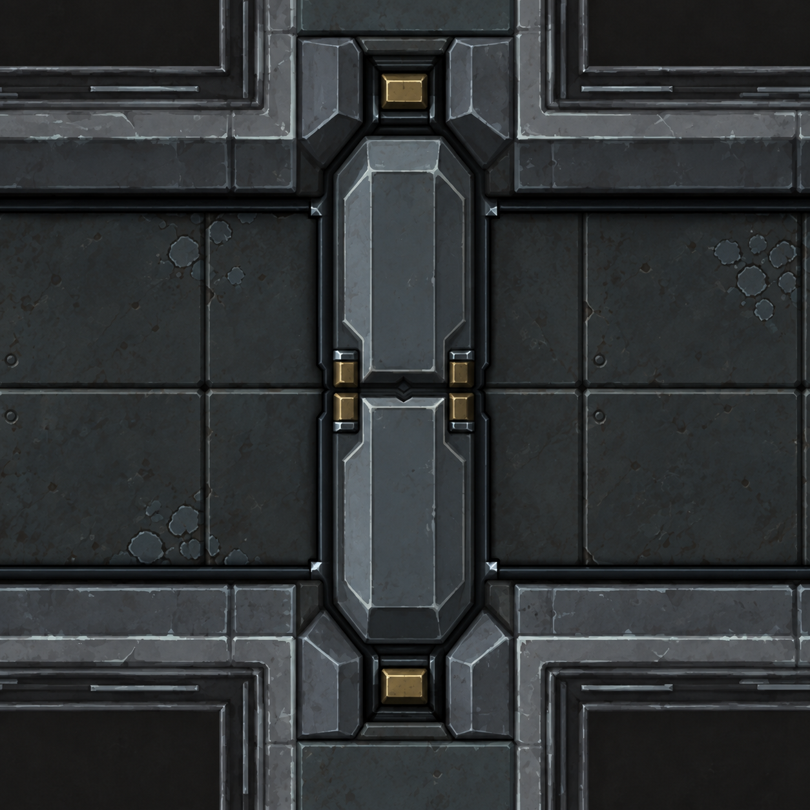
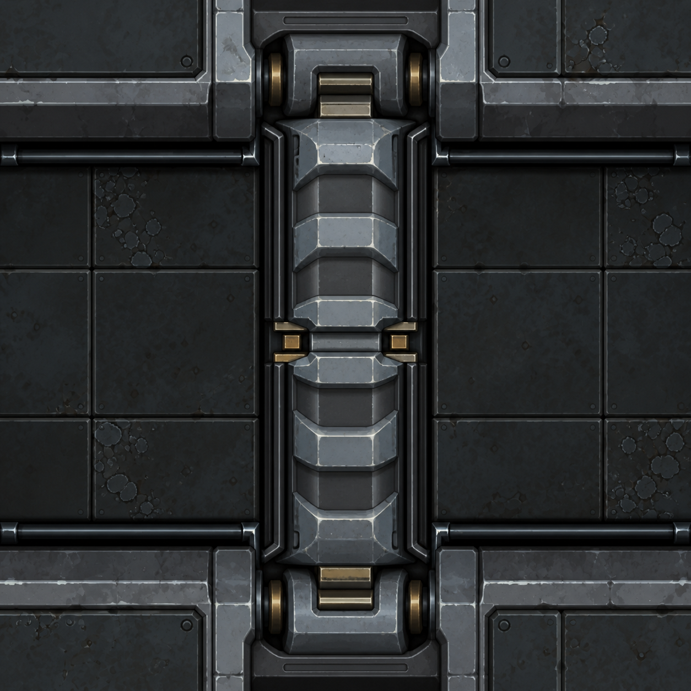
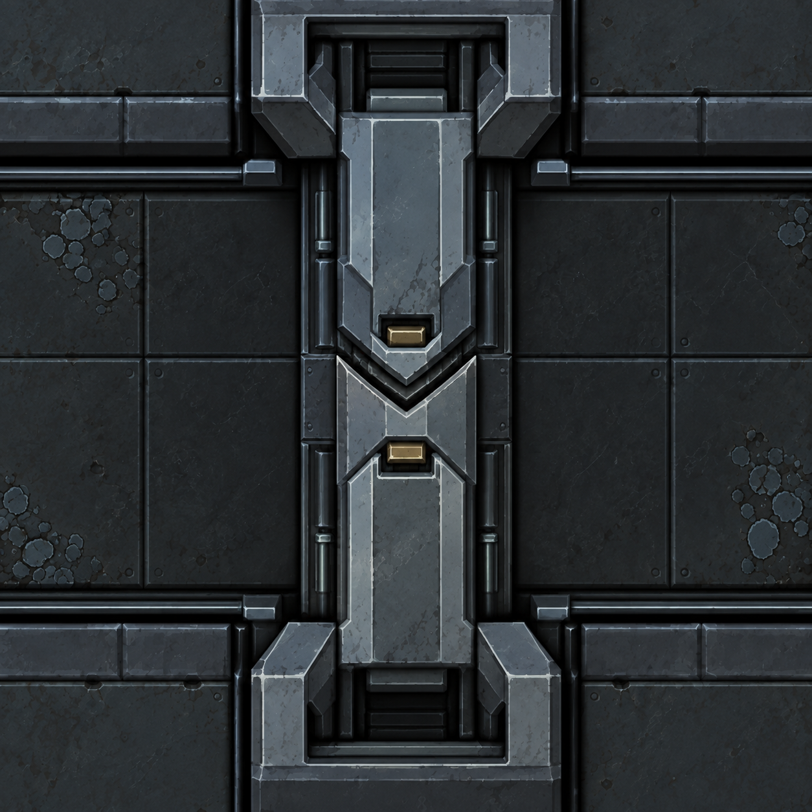

# Portes de sas — trois nouveaux essais, série v2

**12 septembre 2026 — A « Monobloc facetté » retenu par Ludovic : « A est très bien ».**

Après ces recherches, Ludovic autorise la modélisation. La source et les essais
natifs réalisés ensuite sont documentés dans [modele-3d.md](modele-3d.md) ; le texte
ci-dessous conserve le contexte de génération des concepts.

Ludovic rejette la v1 : « Hum non d'autres essais, pas très jolie là ». La v1 reste historique et ne sert plus de direction retenue.

Les trois essais proposent des constructions distinctes, en conservant la bande verticale et la traversée gauche/droite :
- **A — Monobloc facetté :** deux coques sobres à larges chanfreins, carters anguleux intégrés aux murs.
- **B — Nervures industrielles :** relief marqué par trois renforts épais par vantail, logements à épaules arrondies.
- **C — Panneaux imbriqués :** plaques en épaisseur et joint central en chevron.

Le choix de Ludovic est A ; il remplace la préférence précédemment exprimée par l'assistant pour B. B et C restent des alternatives non retenues. La validation porte sur l'apparence de l'étude fermée. Les images ne sont ni des captures natives ni des modèles Blender. Le dessin des sols ne constitue pas une grille de cotation ; l'ouverture de trois cases, la hauteur de coupe, les logements et la cinématique devront être respectés dans une future source. Les pièces au joint central doivent accompagner les vantaux, les guides rester franchissables et le nez mobile demeurer visible à l'ouverture. Aucun code, modèle ou comportement du jeu modifié.

## Entrées communes et outil

Trois appels distincts à l'outil **ImageGen intégré** (`image_gen.imagegen`), un par essai, sans CLI. Les deux références ont été inspectées avant génération et leurs rôles figurent dans chaque prompt :
1. [Étude peinte de porte ordinaire](../door-3d-study/door-painted-study.png) : palette, matières, murs coupés et qualité picturale. Cette référence est elle-même générée ; les captures natives demeurent dans le dossier de porte.
2. [Capture utilisateur originale du sas](sas-original.png) : implantation et orientation uniquement.

La v1 rejetée n'a pas été donnée en référence. Sorties originales conservées sous `C:/Users/anaki/.codex/generated_images/01a0915e-83fb-73d2-8ed5-4be654015111/`. Copies versionnées ci-dessous, sans retouche ; SHA comparés aux originaux. Les trois sorties ont été inspectées pour leur sujet, leur axe et la distinction des dessins. Aucun test du jeu nécessaire à ces seules images d'étude.

## A — Monobloc facetté



Fichier : [direction-v2-a-monobloc.png](direction-v2-a-monobloc.png). Original : `exec-0afc4c56-2f5c-48b1-8611-c8c34736034e.png`.
SHA-256 : `c265e375b0d68ca7878d32f46b1718462364445d9bf4797f69cfd834b8b382cf`.

### Prompt exact

```text
Use case: stylized-concept. Create a new, attractive airlock-door design proposal for the top-down spaceship game TheEnd, shown as an enlarged 3D rendered sprite in its corridor. One concept, one CLOSED airlock, square canvas.

References:
IMAGE 1: painted ordinary door study, for visual quality, weathered slate-blue metal, material variation, restrained worn edges, cutaway walls, dark floor and camera. Ignore characters, captions and two-panel layout.
IMAGE 2: old vector screenshot, for TOPOLOGY ONLY. Do not copy its flat grey rectangles, hatching, thin outline style or square corner blocks.
The user disliked the first airlock proposal because it was unattractive. We need genuinely redesigned geometry and stronger authored forms.

Camera and topology are mandatory: overhead near-orthographic cutaway, north straight up, NOT front elevation and NOT isometric. Corridor extends left to right across the image. The long narrow door barrier runs vertically north-south across THREE floor cells. Wall blocks bound the top and bottom edges of the corridor. Two leaves meet around the midpoint of the VERTICAL BAND, across a horizontal or shallow chevron sealing joint. The top leaf retracts north and bottom leaf south. Show only the closed state. Door is standing at wall height, seen on its cut top/shoulders, not a floor hatch. Visible door thickness about one cell; opening length three cells. Substantial actuator housings merge into the upper and lower wall blocks. Low rails, no raised fixed bar across the walking floor. Crop close so the door fills most of the height but show its two ends and some corridor on both sides.

Rendering: refined, coherent 3D game art, painted industrial spacecraft steel, convincing sculpted mass, broad bevels and short soft shadows. Worn cool blue-grey paint, graphite internals, restrained warm brass detail. Mostly clean legible surfaces with selective edge wear. Strong separation of broad light-catching top planes, medium-dark sides, and dark gasket recesses. No scratch/noise carpet, no dramatic fog, no emissive lighting, no characters. Quality and readable shape first. Eliminate the drawer-like flat rectangle with a handle on each leaf, and avoid nesting many thin outlined rectangles.

No title, labels, logo, text, UI, watermark or split view. This is an art study, not a dimensioned engineering drawing.

DESIGN A — QUIET FACETED CASTING.
Each of the two rigid leaves is one substantial dark blue-grey pressed/cast steel shell with clipped corners, broad gently convex faceted shoulders and a long uninterrupted crown. Deliberately elegant and minimal. A single large recessed armour inset is permitted, bounded by broad shaped edges rather than thin trim. No little crossbar handles. The center meeting noses form a shallow opposing wedge and a precise slim rubber compression seal, with one discrete recessed steel dog at either edge. The two end housings are sculpted chamfered blocks inset into the wall, each with a dark narrow leaf-mouth and a single small recessed brass actuator cap. Give the door a strong sculpted silhouette through facets and mass, not bolt density. Broad calm planes, few excellent details. Match the game's restrained painterly materials.
```

## B — Nervures industrielles



Fichier : [direction-v2-b-nervures.png](direction-v2-b-nervures.png). Original : `exec-2422a1e4-fe7d-40b3-8d0e-e63cc78d518a.png`.
SHA-256 : `bf7c99b848302e9740f2fb0d6d384f465f60e5a5aff256905268ba0fd34afdf4`.

### Prompt exact

```text
Use case: stylized-concept. Create a new, attractive airlock-door design proposal for the top-down spaceship game TheEnd, shown as an enlarged 3D rendered sprite in its corridor. One concept, one CLOSED airlock, square canvas.

References:
IMAGE 1: painted ordinary door study, for visual quality, weathered slate-blue metal, material variation, restrained worn edges, cutaway walls, dark floor and camera. Ignore characters, captions and two-panel layout.
IMAGE 2: old vector screenshot, for TOPOLOGY ONLY. Do not copy its flat grey rectangles, hatching, thin outline style or square corner blocks.
The user disliked the first airlock proposal because it was unattractive. We need genuinely redesigned geometry and stronger authored forms.

Camera and topology are mandatory: overhead near-orthographic cutaway, north straight up, NOT front elevation and NOT isometric. Corridor extends left to right across the image. The long narrow door barrier runs vertically north-south across THREE floor cells. Wall blocks bound the top and bottom edges of the corridor. Two leaves meet around the midpoint of the VERTICAL BAND, across a horizontal or shallow chevron sealing joint. The top leaf retracts north and bottom leaf south. Show only the closed state. Door is standing at wall height, seen on its cut top/shoulders, not a floor hatch. Visible door thickness about one cell; opening length three cells. Substantial actuator housings merge into the upper and lower wall blocks. Low rails, no raised fixed bar across the walking floor. Crop close so the door fills most of the height but show its two ends and some corridor on both sides.

Rendering: refined, coherent 3D game art, painted industrial spacecraft steel, convincing sculpted mass, broad bevels and short soft shadows. Worn cool blue-grey paint, graphite internals, restrained warm brass detail. Mostly clean legible surfaces with selective edge wear. Strong separation of broad light-catching top planes, medium-dark sides, and dark gasket recesses. No scratch/noise carpet, no dramatic fog, no emissive lighting, no characters. Quality and readable shape first. Eliminate the drawer-like flat rectangle with a handle on each leaf, and avoid nesting many thin outlined rectangles.

No title, labels, logo, text, UI, watermark or split view. This is an art study, not a dimensioned engineering drawing.

DESIGN B — STRUCTURAL RIBS AND PRESSURE SHELL.
Make a distinctly industrial shipyard pressure bulkhead. Each rigid leaf has a shallow arched blue-grey structural shell with THREE broad tapered ribs cast integrally into its upper surface. The ribs run transversely left-right across the narrow leaf thickness, spaced along each north-south half; they are wide raised buttresses merging smoothly into rounded shoulders, not thin drawer handles. Recessed darker steel bays between the ribs give deep, readable relief. Exposed side edges have a narrow continuous graphite rubber seal. Central meeting has a straight horizontal thick polished compression lip and two compact recessed mechanical dogs that belong to the moving leaves. End housings are rounded heavy cast saddles recessed into the upper and lower walls, with partially sheltered guide rollers visible only near their mouths. Strong material mass, purposeful construction, a few worn brass actuator ends. No spiky armour, no loose pistons on the walking floor.
```

## C — Panneaux imbriqués



Fichier : [direction-v2-c-imbriques.png](direction-v2-c-imbriques.png). Original : `exec-f7f6598f-d039-4e22-be8b-6a87ea975d89.png`.
SHA-256 : `1508266ad5ff85cba677d174d63a48d8aa826a8808a0e8f335eeb0154c66ae95`.

### Prompt exact

```text
Use case: stylized-concept. Create a new, attractive airlock-door design proposal for the top-down spaceship game TheEnd, shown as an enlarged 3D rendered sprite in its corridor. One concept, one CLOSED airlock, square canvas.

References:
IMAGE 1: painted ordinary door study, for visual quality, weathered slate-blue metal, material variation, restrained worn edges, cutaway walls, dark floor and camera. Ignore characters, captions and two-panel layout.
IMAGE 2: old vector screenshot, for TOPOLOGY ONLY. Do not copy its flat grey rectangles, hatching, thin outline style or square corner blocks.
The user disliked the first airlock proposal because it was unattractive. We need genuinely redesigned geometry and stronger authored forms.

Camera and topology are mandatory: overhead near-orthographic cutaway, north straight up, NOT front elevation and NOT isometric. Corridor extends left to right across the image. The long narrow door barrier runs vertically north-south across THREE floor cells. Wall blocks bound the top and bottom edges of the corridor. Two leaves meet around the midpoint of the VERTICAL BAND, across a horizontal or shallow chevron sealing joint. The top leaf retracts north and bottom leaf south. Show only the closed state. Door is standing at wall height, seen on its cut top/shoulders, not a floor hatch. Visible door thickness about one cell; opening length three cells. Substantial actuator housings merge into the upper and lower wall blocks. Low rails, no raised fixed bar across the walking floor. Crop close so the door fills most of the height but show its two ends and some corridor on both sides.

Rendering: refined, coherent 3D game art, painted industrial spacecraft steel, convincing sculpted mass, broad bevels and short soft shadows. Worn cool blue-grey paint, graphite internals, restrained warm brass detail. Mostly clean legible surfaces with selective edge wear. Strong separation of broad light-catching top planes, medium-dark sides, and dark gasket recesses. No scratch/noise carpet, no dramatic fog, no emissive lighting, no characters. Quality and readable shape first. Eliminate the drawer-like flat rectangle with a handle on each leaf, and avoid nesting many thin outlined rectangles.

No title, labels, logo, text, UI, watermark or split view. This is an art study, not a dimensioned engineering drawing.

DESIGN C — INTERLOCKING ARMOUR, SHALLOW CHEVRON JOINT.
Create a distinctive angular airlock with two rigid leaves whose broad overlapping armour plates form a restrained arrowhead composition pointing toward the middle. The central compression seam is a clear shallow chevron: upper leaf projects one wide downward wedge, lower leaf receives it, without sideways hooks. North-south sliding remains geometrically plausible. Each leaf has only two or three substantial stepped slate-blue steel plates, large bevels and graphite channels giving elegant layered depth. Vary the plate value subtly; do not cover them with rivets or tiny panels. A single recessed muted brass lock shoe is integrated on each side of the center seam and travels with its leaf. The top and bottom wall housings have matching oblique shoulders and deep dark mouths. Low side guides remain part of the threshold, not an obstructing center crossbar. The strong chevron and stepped armour make this visibly different from a flat rectangle or a ribbed door.
```
